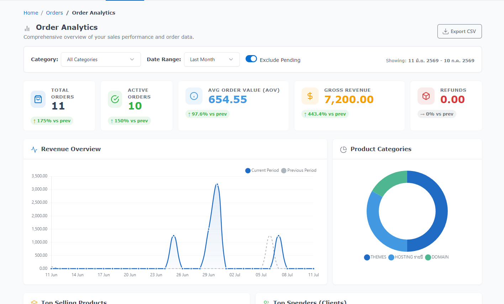

# Order Analytics — FOSSBilling Module



A comprehensive analytics dashboard for [FOSSBilling](https://www.fossbilling.org/), designed to give you deep insights into your sales, revenue growth, top-performing products, and top clients.

**Compatibility:** Fully compatible with FOSSBilling 0.8.2+

## Key Features

- **Advanced Filtering:** Filter the entire dashboard by custom Date Ranges and Product Categories in real-time.
- **Pending Setup Toggle:** Easily exclude or include `pending_setup` orders with a single switch.
- **Growth Metrics:** Summary cards showing Total Orders, Active Orders, Revenue, Refunds, and Average Order Value (AOV) with % growth indicators comparing to the previous period.
- **Comparative Charts:** Beautiful Revenue Overview line chart that overlays the current period against the previous period.
- **Distribution Charts:** Doughnut charts for "Product Categories" and "Top Payment Gateways".
- **Leaderboards:** Discover your "Top Selling Products" and "Top Spenders/Clients".
- **Sleek UI:** Modern dashboard built with Tabler components matching the FOSSBilling admin area.

## Installation

1. Download the latest `.zip` release from the [Releases page](../../releases).
2. Extract the archive and copy the `OrderAnalytics` folder into the `modules/` directory of your FOSSBilling installation.
3. Log in to your FOSSBilling Admin area.
4. Navigate to **Extensions > Modules**.
5. Find **Order Analytics** and click install.

## Project Structure

```text
OrderAnalytics/
├── manifest.json
├── README.md
├── CHANGELOG.md
├── icon.svg
├── Api/
│   └── Admin.php           # API endpoints
├── Controller/
│   └── Admin.php           # Admin routes and menu registration
├── Service.php             # Core logic and SQL queries
└── templates/
    └── admin/
        └── mod_orderanalytics_index.html.twig # Dashboard UI
```

## Changelog

See the [CHANGELOG.md](CHANGELOG.md) file for details on version history.

## ☕ Donate

Support this project:

- $5   https://linksplus.omise.co/lN1VTj2Obw
- $10   https://linksplus.omise.co/3zeILGb32v
- $25   https://linksplus.omise.co/cckjTvJlHq
- $50   https://linksplus.omise.co/XmW40xA4yE
